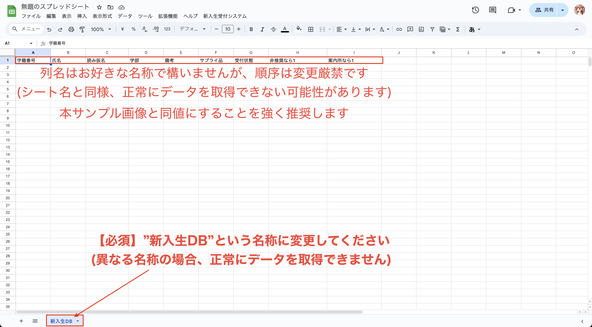
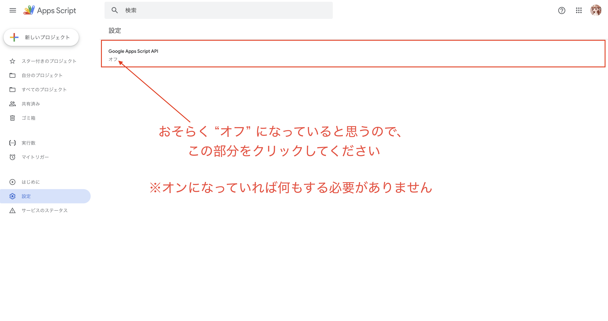
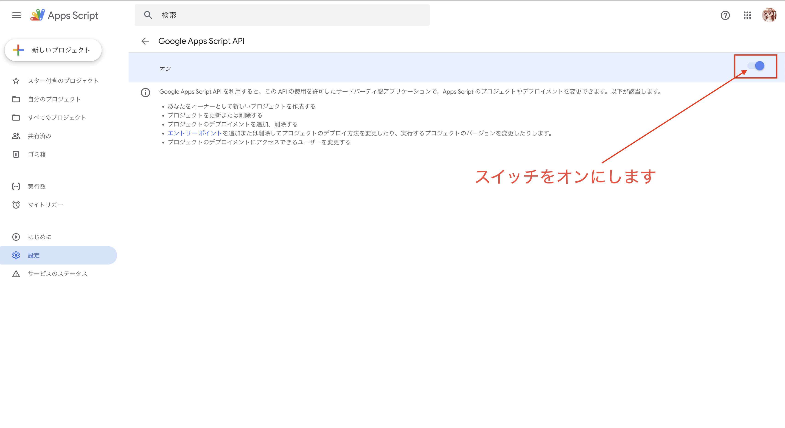

# 本番セットアップを行う
4月に受付を行うPCで本システムを展開する手順を説明します。  
本セクションではコマンドを用いた操作が多くなりますので、CSの学生が行うのが望ましいです。

- [本番セットアップを行う](#本番セットアップを行う)
  - [前提条件](#前提条件)
- [手順](#手順)
  - [1. 新入生のデータを格納するシートを作成する](#1-新入生のデータを格納するシートを作成する)
  - [2. スプレッドシートにシステムをアップロードする環境を整える](#2-スプレッドシートにシステムをアップロードする環境を整える)
    - [1. Node.js, pnpm, TypeScript, claspのインストール](#1-nodejs-pnpm-typescript-claspのインストール)
      - [Voltaのインストール](#voltaのインストール)
      - [Node.jsのインストール](#nodejsのインストール)
      - [pnpmのインストール](#pnpmのインストール)
      - [TypeScriptのインストール](#typescriptのインストール)
      - [claspのインストール](#claspのインストール)
    - [2. claspのログイン](#2-claspのログイン)
      - [APIの有効化](#apiの有効化)
      - [claspのログイン](#claspのログイン)
    - [3. このレポジトリをクローンする](#3-このレポジトリをクローンする)
    - [4. 依存パッケージをインストールする](#4-依存パッケージをインストールする)
    - [5. `.clasp.json` ファイルを作成する](#5-claspjson-ファイルを作成する)
      - [スクリプトIDの取得](#スクリプトidの取得)
      - [rootDirの取得](#rootdirの取得)
    - [6. 初回デプロイIDを取得する](#6-初回デプロイidを取得する)
    - [7. `.env` ファイルを作成する](#7-env-ファイルを作成する)
    - [8. ビルドする](#8-ビルドする)
    - [9. スプレッドシートにシステムをアップロードする](#9-スプレッドシートにシステムをアップロードする)
    - [10. 動作確認](#10-動作確認)
- [自動プリントを有効にした状態で起動する](#自動プリントを有効にした状態で起動する)
    - [Chromeをキオスクモードで起動する](#chromeをキオスクモードで起動する)

## 前提条件
- シェルが動かせる環境であること (bash, zsh, fishなど)
  - Mac, Linuxの場合
    - 特に問題ありません。ターミナルが使えることを確認してください。
  - Windowsの場合
    - **WSL2**がインストールされている必要があります。
    - インストール方法については、[こちら](https://docs.microsoft.com/ja-jp/windows/wsl/install)を参照してください。
    - CSの学生であれば、1年生の情報リテラシーの講義でインストール済みのはず(2022年現在)です。
- Googleアカウントを持っていること
  - Google Spread Sheetを作成するために必要です。
  - 初回作成した際は、喜多さんがPCサポートセンターのアカウントで作成していました。
  - 作業を行う前にPCサポートセンターの方に確認してください。

# 手順
以下の手順に従って、本番セットアップを行ってください。

## 1. 新入生のデータを格納するシートを作成する
スプレッドシートを開き、以下の画像のようなシートを作成してください。  
※データもこの際追加してください。

> [!WARNING]
> シート名は`新入生DB`としてください。  
> また、シートの1行目にデータの名称を入れてください。 (画像通りに入れると良いです)




## 2. スプレッドシートにシステムをアップロードする環境を整える
スプレッドシートにシステムを展開するための環境を整えます。  
以下のコマンドをそれぞれ実行してください。  
※2023年現在の手順です。バージョンが変わっている可能性がありますので、最新の手順を確認してください。

### 1. Node.js, pnpm, TypeScript, claspのインストール

#### Voltaのインストール
```bash
curl https://get.volta.sh | bash
```

#### Node.jsのインストール
```bash
volta install node@18.18.2
```

#### pnpmのインストール
```bash
volta install pnpm@8.14.1
```

#### TypeScriptのインストール
```bash
volta install typescript
```

#### claspのインストール
```bash
volta install @google/clasp
```

### 2. claspのログイン
#### APIの有効化
以下のURLにアクセスし、Google Apps Script APIを有効化してください。
https://script.google.com/home/usersettings

画像の手順に従って有効化してください。





#### claspのログイン
以下のコマンドを実行し、Googleアカウントにログインしてください。
```bash
clasp login
```
以下のような画面(例)が表示されますので、指示に従ってログインしてください。
```bash
? Open the following link in your browser:
https://accounts.google.com/o/oauth2/auth?access_type=offline&scope=https%3A%2F%2Fwww.googleapis.com%2Fauth%2Fscript.projects+https%3A%2F%2Fwww.googleapis.com%2Fauth%2Fdrive+https%3A%2F%2Fwww.googleapis.com%2Fauth%2Fdrive.scripts+https%3A%2F%2Fwww.googleapis.com%2Fauth%2Fspreadsheets&response_type=code&client_id=xxxxx.apps.googleusercontent.com&redirect_uri=urn%3Aietf%3Awg%3Aoauth%3A2.0%3Aoob
```

以下のような画面が表示されたら、ログインが完了です。
```bash
? Authorization successful
```

### 3. このレポジトリをクローンする
```bash
git clone https://github.com/MediaLobby-dev/new_student_reception_system
```
※クローンしたディレクトリに移動してください。
```bash
cd new_student_reception_system
```

### 4. 依存パッケージをインストールする
```bash
pnpm install
```

### 5. `.clasp.json` ファイルを作成する
`.clasp.json.sample` から `.clasp.json` ファイルを作成してください。
```bash
cp .clasp.json.sample .clasp.json
```

```
{
  "scriptId": "スクリプトID",
  "rootDir": "coreディレクトリまでの絶対パス/core"
}
```
#### スクリプトIDの取得
GASのスクリプトを開いた際のURLの `https://script.google.com/home/projects/<スクリプトID>/edit` の、`<スクリプトID>` の部分をコピーして貼り付けてください。

#### rootDirの取得
以下のコマンドで、coreディレクトリまでの絶対パスを取得できます！
```bash
pnpm run viewPath
```

```bash
> newstudentreceptionsystem@0.0.0 viewPath /パス/medialobby/new_student_reception_system
> pwd | echo $(cat)'/core'

coreディレクトリまでの絶対パス/core ← この部分をコピーして貼り付け
```

### 6. 初回デプロイIDを取得する
以下のコマンドを実行し、初回デプロイIDを取得してください。
```bash
pnpm run initPush
```

以下のような画面が表示されますので、初回デプロイID(半角英数字の羅列 74文字)をコピーしてください。
```bash
Created version 1.
- <半角英数字の羅列 74文字> @1.
```

### 7. `.env` ファイルを作成する
`.env.sample` から `.env` ファイルを作成してください。
```bash
cp .env.sample .env
```
先程取得した初回デプロイIDを `.env` ファイルに追記してください。
```
# プリントサービスのデプロイID
VITE_PRINT_SERVICE_DEPLOY_ID="<半角英数字の羅列 74文字>"
```

### 8. ビルドする
```bash
pnpm run build
```

以下のような表示が出れば成功です。
```bash
> newstudentreceptionsystem@0.0.0 build /Users/kakeru/work/medialobby/new_student_reception_system
> tsc && vite build

vite v5.0.11 building for production...
✓ 158 modules transformed.
core/webpanel/index.html  987.13 kB │ gzip: 439.35 kB
✓ built in 972ms
```

### 9. スプレッドシートにシステムをアップロードする
```bash
pnpm run push
```
以下のような表示が出れば成功です。
```bash
> newstudentreceptionsystem@0.0.0 push /Users/kakeru/work/medialobby/new_student_reception_system
> dotenv -- bash -c 'clasp push && clasp deploy --description $(date +'%Y.%m.%d.%I.%M.%S') --deploymentId $VITE_PRINT_SERVICE_DEPLOY_ID'

└─ /<パス>/new_student_reception_system/core/appsscript.json
└─ /<パス>/new_student_reception_system/core/main.ts
└─ /<パス>/new_student_reception_system/core/printPage/index.html
└─ /<パス>/new_student_reception_system/core/webpanel/index.html
Pushed 4 files.
Created version 2.
- <半角英数字の羅列 74文字> @2.
```

以上で、スプレッドシートにシステムがアップロードされます。

### 10. 動作確認
スプレッドシートを開き、メニューに `新入生受付システム` が追加されていることを確認してください。  


以上でセットアップは完了です。
お疲れさまでした🎉

<br>

# 自動プリントを有効にした状態で起動する
自動プリントを有効にした状態で起動するためには、以下の手順を行ってください。

### Chromeをキオスクモードで起動する
```ps1
> "C:\Program Files\Google\Chrome\Application\chrome.exe" --kiosk --kiosk-printing --disable-pinch "<スプレッドシートのURL>"
```

または、本プロジェクトルート直下にある`start.bat`を実行することで起動できます。(batファイルは可搬です)
```ps1
> start.bat "<スプレッドシートのURL>"
```
**Chromeのプロセスが完全に終了していることを確認してから実行してください。プロセスが生存している状態で実行するとキオスクモードで起動しません！！**
